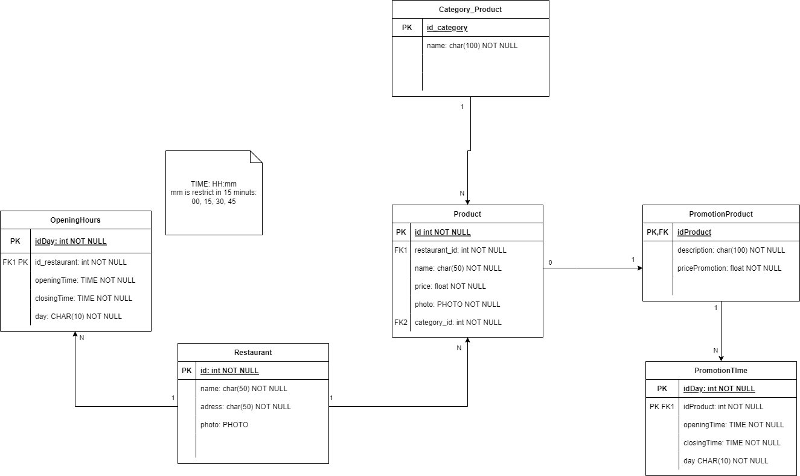

# Iniciando

Inicialmente você deve ter instalado o docker e o docker-compose caso ainda não tenha em sua maquina

Para subir os 2 containers você deve executar os comandos a seguir na pasta que esta localizada o Dockerfile
    
    docker build -t abraaoabe/dockernode .
    docker-compose -f docker-compose.yml up
    docker-compose -f docker-compose_api.yml up

Lembre-se de esperar o banco de dados subir (segundo comando terminar) antes de dar o terceiro comando

Você pode testar a aplicação pelo navegador colocando algumas dessas urls (lembre-se de deixar a porta 3000 livre)

    http://localhost:3000/restaurants
    http://localhost:3000/products
    http://localhost:3000/categorys

Ou caso queira testar um ID especifico utilize

    http://localhost:3000/restaurants/ID
    http://localhost:3000/products/ID
    http://localhost:3000/categorys/ID

teste também

    http://localhost:3000/restaurants_products/
    http://localhost:3000/opening/ID
    http://localhost:3000/categorys_products/ID

Substitua o ID por um id valido no banco de dados

# testes unitarios
Para fazer o teste unitario modifique a linha 12 no dockerfile para 
    
    CMD ["npm", "test"]

E refazer os comandos de build e composição da api (lembre-se de matar seus containers)

serão feitos testes de GET/POST/PUT/DELETE automatizados, alguns deles terão o retorno impresso na tela
# Considerações 

foi feito uma modificação para execução de dois dockers_compose, pois ao tentar subir o banco e a aplicação juntos, a aplicação subia primeiro e tentava a conexão porém o banco ainda não estava pronto e gerava um erro, pode ser resolvido com o uso de alguma ORM e funções assincronas para atrasar ou tentar novamente a conexão.
    
# Maiores dificuldades

- Triggers: sintaxe muito dificil de aplicar, qualquer detalhe gera um erro catastrófico e
    nao tem tantas fontes de informações sobre, tem que correr um pouco atrás para chegar num resultado.
- Normalizar as tabelas: Inicialmente fiz um esqueleto do modelo relacional do banco, porém com o passar do tempo vi que poderia ficar ainda melhor com a adição de alguns uniques e mudando algumas chaves.

- Funções: assim como as triggers possui uma sintaxe bastante especifica e contém com inumeras funções prontas

- Acertar a configuração de dois cotainers, foi extremamente dificil ao ponto de precsicar nao dormir, revirei muitos e muitos sites, mas na proxima vez ja sei oq fazer kskdakk, uma experiencia muito marcante xD

# Tecnologias Utilizadas

- node, express, postgres, docker, tape e supertest para testes

# Estruturas das tabelas

- A tabela promo_product tem como chave primária prod_id da tabela produtos, pois não tem promoção sem ter o produto.
    
- A tabela de opening_hours tem como unique(op_day, rest_id) fazendo com que o registro duplicado de dias da semana nao exista, por restaurante (o mesmo para a tabela promo_time com os produtos)

- A tabela category prod, para que possa deletar ou alterar uma tupla da tabela, a categoria deve não estar sendo utilizada por nenhum produto

- As tabelas opening_hours e promo_time possuem uma função que checa se os minutos inseridos ou atualizados são divisíveis por 15 (MIN%15 = 0)

- Para a tupla na tabela promo_time existir, antes o prod_id deve ser adicionado na tabela de promo_product, assim evitanto que seja adicionado uma data de promoção sem o produto estar em promoção

- Deletar um restaurante faz com que seus produtos e todas as referencias a eles também se apaguem, assim como a opening_hours

- Deletar uma promoção faz com que as datas da promoção também se apaguem

# Ajudando a entender a estrutura do banco

# Estrutura dos containers 

São dois containers, o container 1 executa o banco de dados e o container 2 executa a aplicação na qual temos a comunicação, a aplicação então se comunica com o banco de dados e é assim que temos nossa API

